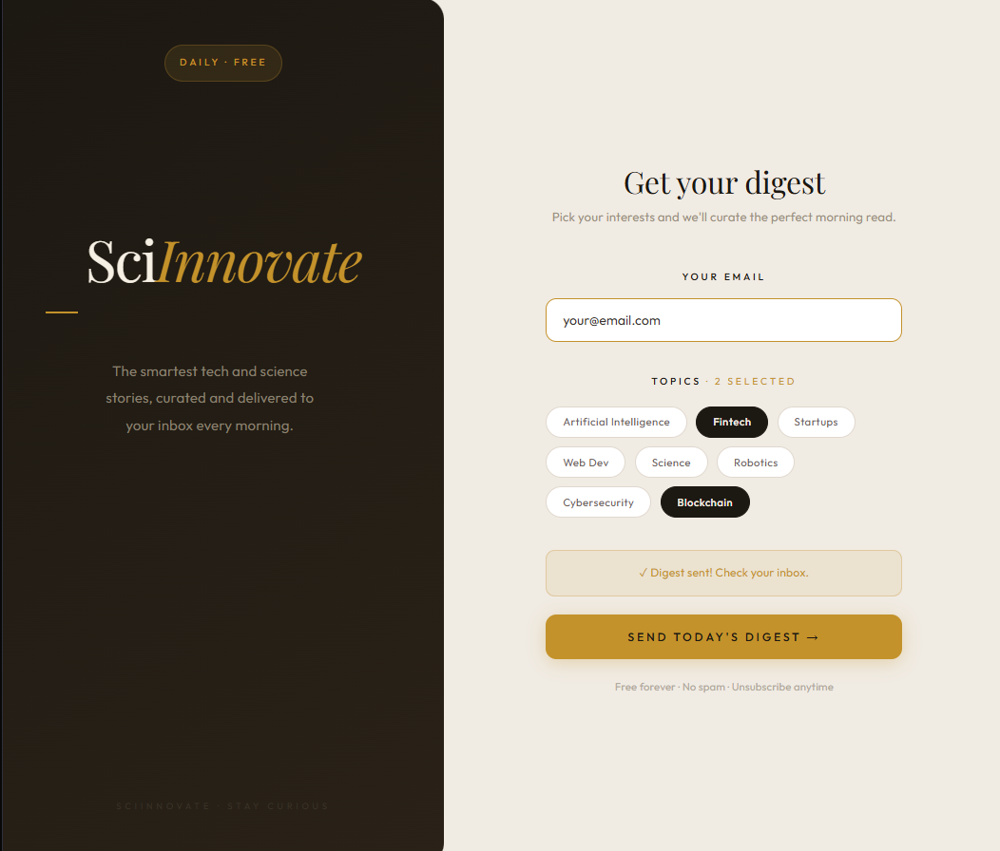

# SciInnovate

A personalised email digest API with a branded UI. Pick your interests, enter your email, get curated tech and science headlines delivered instantly.

<p align="center">
  
</p>

## What it does

User selects topics of interest and enters their email. The app fetches the latest headlines from NewsAPI, builds a branded HTML email, and sends it programmatically via Gmail. No subscriptions, no databases.
## Tech Stack

**Backend**
- Python 3
- Flask — REST API
- NewsAPI — headline sourcing
- smtplib — email delivery
- Flask-CORS — cross-origin requests

**Frontend**
- React + Vite
- Axios — API calls

## API

**POST** `/send-digest`
```json
{
  "email": "your@email.com",
  "topics": ["AI", "Fintech", "Startups"]
}
```

Returns confirmation and sends a branded HTML email.

## Running Locally

**Backend**
```bash
cd scinnovate
venv\Scripts\activate
python app.py
```

**Frontend**
```bash
cd frontend
npm run dev
```

## Author

**Omobolanle Sadela**  
[GitHub](https://github.com/bolanlesadela) · [LinkedIn](https://www.linkedin.com/in/omobolanle-sadela-7a486a1b4/)
